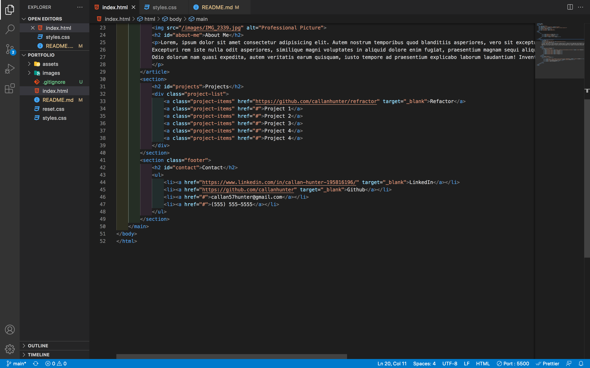

# portfolio

### In this project I created a portfolio. The color scheme was inspired from a friends portfolio and the layout was inspired from a high school teachers portfolio. About Me, Professional Picture, Projects, and Contact Information holders are all present within the portfolio. These will leave for a great layout for future use if so desired.

# Features

### Some features of the portfolio include: when you hover over the projects, they enlarge, the navbar is linked to the sections, and the links will take you to the desired place. The page will also adjust according to the screen's resolution.

# Usage

### 

### In the screenshot above you can see in the div with the class id of "Projects" that only one project is currently linked. As stated above, this will leave for a great layout for future use. All that is required is putting in the link.

# Languages Used

### HTML and CSS were used in this project

# Link

### https://callanhunter.github.io/portfolio/
